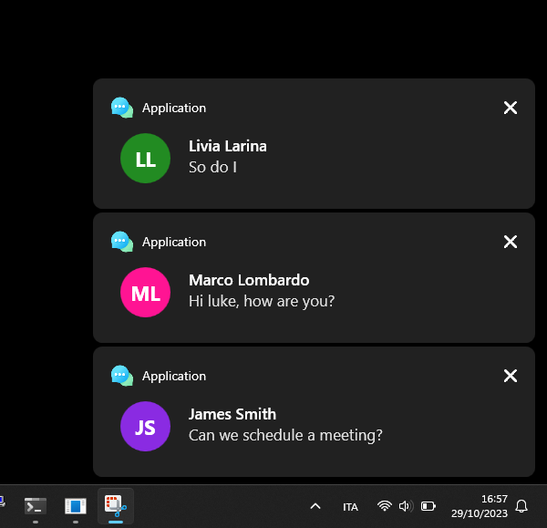

# NotificationLibrary

## Overview
The "Custom WPF Notifications" project aims to provide a flexible and user-friendly notification system for WPF (Windows Presentation Foundation) applications. This system leverages the NotificationLibrary, a specialized class named Notification, to create and display custom notifications within your WPF application.



## Key Features:

Customizable Notifications: The heart of the system is the Notification class, which allows you to create notifications with the following customizable properties:

- __Title:__ Set a title for your notification.
- __Message:__ Provide a detailed message to convey information.
- __Initials:__ Display user initials or an identifier.
- __DBID:__ Attach a unique identifier to each notification.
- __Application Name:__ Specify the application name to associate with the notification.
- __Color:__ Choose a custom color for the notification background.
- __Application Icon:__ Add an application icon to make notifications easily identifiable.
- __Tagging Notifications:__ Notifications are tagged for easy management and identification. Each notification is assigned a unique tag based on its hash code.

## Getting Started:
#### Inserting Notifications:
```csharp
BitmapImage applicationIcon = new BitmapImage(new Uri("icon.png")); // Replace "icon.png" with the path to your application's icon image.

// Define the application name, title, message, initials, a unique identifier (dbid), and the background color for the notification.
string applicationName = "Your Application Name";
string title = "Notification Title";
string message = "Notification message goes here.";
string initials = "AB";
string dbid = "unique_identifier";
Color color = Colors.Blue; // Customize the color as needed.

// Insert the notification using the Notification class
Notification.InsertNotification(applicationIcon, applicationName, title, message, initials, dbid, color);
```

#### Setting Callback for Click Event:
You can define a callback function to handle what happens when a notification is clicked. For example:
```csharp
Notification.SetCallBack((dbid) =>
{
    // Handle the click event here, using the unique identifier (dbid) to identify the notification.
    // You can perform actions like opening a related window or taking the user to a specific location in your application.
    Console.WriteLine($"Notification with DBID {dbid} was clicked.");
});
```

### Contributions:
This project is open to contributions from the developer community to improve and expand its features.
